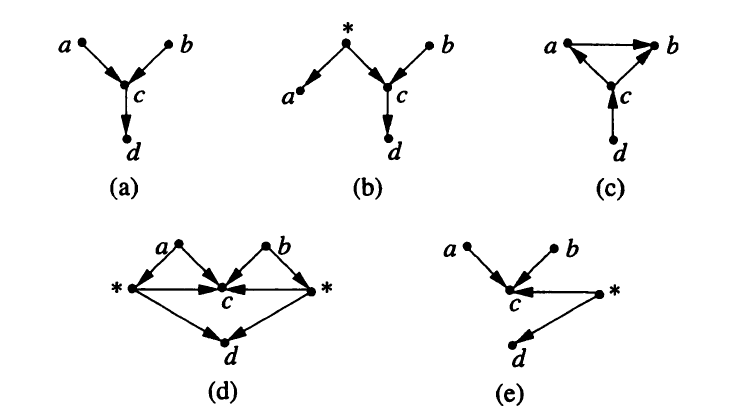
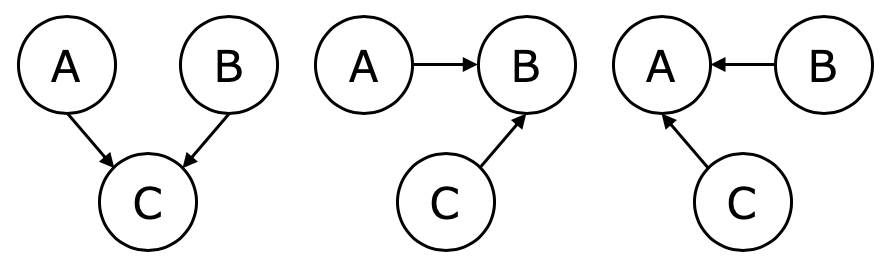
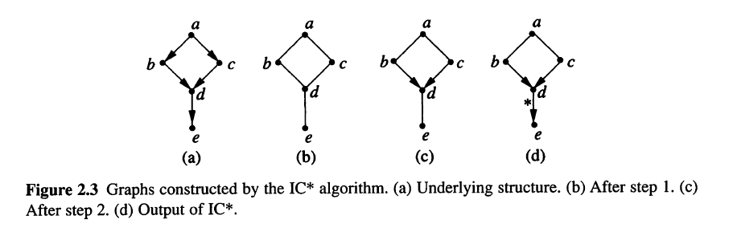
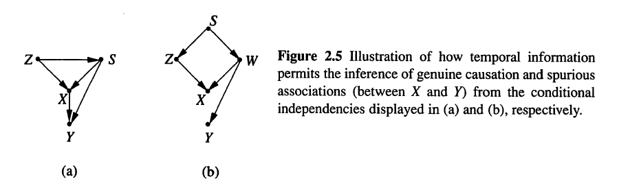

## 2章のまとめ {#first}
\newcommand{\indep}{\mathop{\,\perp\!\!\!\!\!\perp\,}}
\newcommand{\notindep}{\mathop{\,\perp\!\!\!\!\!/\!\!\!\!\!\perp\,}}
\newcommand{\mat}[1]{\begin{pmatrix} #1 \end{pmatrix}}

* 統計解析を用いたからといって、**本質的な原因**と**疑似的な共変動**を完全に区別することは難しいが、多くの場合において区別できる
  * **極小性&定常性**を仮定することで、非観測変数も含んだデータを生成できる因果モデルの候補を構築するアルゴリズムが存在
  * 10個の変数からなるネットワークに対して、5,000以下のサンプルでも構造が復元できる
* データを学習して因果構造を導く方法は、機械学習と類似しているが**実際は異なる**
  * 観察的同値な因果モデルが数多くあるから
  * データに対する適合度は因果構造を実証する基準としては不十分

# 2.1 はじめに

## 基本的な直感

* 観察された結果から因果関係を知りたい
* しかし、統計学では共変動に基づいて解析が行われている(not 因果関係)

* 因果の定義の必要条件
  * 時間的順序
  * 時間情報だけでは、擬似相関と因果関係を区別できない
    * 因果的に重要な要因が事前にすべてわかっているわけではない
    * うまく操作できない変数がある

## 因果構造を探索する手がかり

* 因果構造の特徴を示す統計的関連性のパターン
* 例）AとB、BとCは従属だが、AとCは独立
  * 数学的には左右どっちでもOK
  * しかし、右側は非常に不自然に感じる
* 時間情報がなくても、概念的に因果的方向を表す従属パターンが存在
  * 従属関係を区別すれば、因果的方向の解明に利用できる
  * Rebane-Pearlの回復アルゴリズム
  * 非観測変数を含む一般的なグラフに拡張可能

```{r, include=FALSE}
library(DiagrammeR)
```

<div class="column1">
```{r, echo=FALSE}
grViz("2_1.dot")
```
</div>

<div class="column2">
```{r, echo=FALSE}
grViz("2_2.dot")
```
</div>

# 2.2 因果モデリングのフレームワーク

## 因果構造(定義)

<div class="box">
非巡回有向グラフ(DAG)と変数集合$V$が与えられている。
グラフ上の頂点がそれぞれ$V$の異なる要素に対応し、
矢線のそれぞれが対応する変数間の直接的な関数関係を表す時、
このグラフを変数集合$V$の因果構造という。
</div>

* どの変数とどの変数が直接的な原因か？をグラフで書き表したもの
  * モデルの係数とかは不明でOK
* 因果モデルの設計図的に利用できる
  * $x_i = f_i(pa_i, u_i), \quad i = 1,...,n$
  * 独立な誤差項が含まれていて、関数関係は錯乱させられている
  * 誤差項は「隠れた」「測定できない」条件のこと

## 因果モデル(定義)

<div class="box">
因果構造$D$と、$D$と整合するパラメータ集合$\Theta_D$の組 $M=\langle D, \Theta_D \rangle$
を因果モデルという。

* パラメータ集合$\Theta_D$は、関数$x_i = f_i(pa_i, u_i)$と、確率$P(u_i)$からなる
* 誤差項$U_i$は互いに独立に確率分布$P(u_i)$に従う
</div>

* すべての変数間の関係が詳しく記述されており、マルコフ条件が必ず成り立つ前提
* 親変数以外の原因のいくつかが除外されていてもOKだが、モデルに含まれている他の変数の親は除外NG
* 仮に親集合が限定され過ぎていると、いくつかの変数に同時に影響を与える誤差が存在する


# 2.3 モデルの優位性(オッカムの剃刀)

## 考えられる因果モデルは複数存在

* 得られた分布と適合するモデルは複数存在
  * 因果構造に含まれる変数集合$V$を知ることはできないから
  * モデルに何らかの制約を課す必要がある
* そこで、データと整合するモデルの中から、余計なものは排除したい
  * 選択過程を通して得られたモデルを<b>極小である</b>という

## 潜在構造と構造の優位性

<div class="box">
変数集合$V$の因果構造$D$と、観測変数集合$O \subseteq V$の組を潜在構造という。
潜在構造$L = \langle D, O \rangle$と$L' = \langle D', O \rangle$に対して、因果構造$D'$が観測変数集合$O$の因果構造$D$を表現できるとき、
$L$は$L'$よりも優位であるといい、$L \preceq L'$と記す
</div>

* 余計なものが表現できる必要はなく、目の前のものをより単純に表現できる方が良い

|               |$L_1$ |$L_2$ |
|---------------|------|------|
|パラメータ     |多    |少    |
|表現できる分布 |小    |多    |
|優位かどうか   |優位  |劣位  |

## 推測された因果関係

<div class="box">
分布$\hat P$が与えられた時、$\hat P$と一致する極小的潜在構造の全てにおいて、
変数$C$から変数$E$への有向道が存在する時、$C$は$E$に対して因果的な影響を与えるという。
</div>

* $\hat P$と一致する極小構造は複数存在する
* すべての極小構造で同じ有向道があれば、その変数間の因果関係を認める
  * 道はあるが、向きが異なる場合は無向道


## 識別される因果関係の例

<div class="box">
変数$\{ a,b,c,d \}$の観察データから

* $a$は$b$と独立である $(a \indep b)$
* $d$は$c$を与えた時、$\{ a,b \}$と条件付き独立である $(d \notindep \{a,b\} | c)$
* 上記の関係から論理的に導かれる独立関係を除くいかなる独立関係も、このデータから得られない
</div>

## 続き:極小構造



* a,bのみが極小
* つまり、$c \rightarrow d$の因果関係が、潜在変数の有無に関係なく成り立つ


# 2.4 定常分布

## 定常性

* 実際のデータ生成モデルが極小であることや、極小構造を見つけ出すことは難しい
* 特殊なパラメータ設定をすることで、異なる構造の極小モデルと区別できなくなる構造もある
* 2つのコイン(A,B)を投げて同じ結果の場合1、異なる場合0となる二値の確率変数Cを考える
  * 以下のどれでも、上記の従属パターンを生成可能
  


## 定常性原則(定義)

<div class="box">
$I(P)$を$P$に含まれるすべての条件付き独立関係の集合とする。

$P(\langle D, \Theta_D \rangle)$が$I(P)$以外の独立関係を含まない時、
因果モデル$M= \langle D, \Theta_D \rangle$は定常分布を生成する
$I(P( \langle D, \Theta_D \rangle)) \subseteq I(P( \langle D, \Theta'_D \rangle))$
</div>

* パラメータが変化しても、$P$における独立関係は崩れない
  * 独立関係が増える場合はある(部分集合なので)
* $(X \indep Y|Z)_P \Leftrightarrow (X \indep Y|Z)_D$であるならば、$P$は$M$の定常分布(忠実性の仮定)

## 忠実性と定常性

* データから得た確率分布$P$で$(X \indep Y|Z)$が成立している
* 仮に、$P$を生成した因果構造が、下図のような非忠実な因果グラフだったとする(定理1.2.5参照)
  * $X$も$Y$に対して因果的影響を与えるが、相殺されて、データでは$X \rightarrow Y$が見えなくなっている
  * 係数が特異的な時にのみ起こる
* もし$P$が忠実な因果構造から生成されているなら、$X \rightarrow Y$は削除され、$(X \indep Y|Z)$は定常的に成立
  * 定常性の制約を課すことで、因果関係を絞り込める

```{r, echo=FALSE}
grViz("2_5.dot")
```

# 2.5 DAG構造の復元

## 定常性と因果構造

* 定常性を仮定した場合、潜在変数が存在しない限り、任意の分布は唯一で極小な因果構造を持つ
  * 有向分離基準に基づく同等性
  * 2つの因果構造が同等であることと、それらの因果構造が同じ従属情報を持つことは同値
* 条件付き独立関係を調べることで、DAG $D$の構造を再構築できる
* 同値な構造がいくつか存在しているため、復元されたDAGは一意ではない
  * 矢線と無向辺からなるグラフで表現(パターン)
  * 無向辺は矢線の向きが決まらないという意味
  
## ICアルゴリズム{#IC_1}

1. $V$から任意の変数組$(a,b)$を取り出し、$a \indep b|S_{ab}$となる集合$S_{ab}$を探索する。
このような$S_{ab}$が見つからない場合、$a$と$b$を無向辺で結び、無向グラフを構築する

1. $S_{ab}$が存在する時、互いに隣接しない$a$と$b$が共通の隣接点として$c$を保つ場合、$c\in S_{ab}$であるかどうかを調べる

    1. $c \in S_{ab}$であれば、矢印は加えない
    1. $c \notin S_{ab}$であれば、$a \rightarrow c \leftarrow b$を加える

1. 次の規則に従って、ステップ2で得られた部分的有向グラフの無向辺にできるだけ多く矢印を加える

    1. 新しいv字合流を作るような矢印は加えない
    1. 巡回道を作るような矢印を加えない

## ICアルゴリズム(つづき){#IC_2}

ステップ3はいくつかの規則により構成されている

1. $a$と$c$が隣接しないが、$a \rightarrow b$がある場合は、$b - c$に$b \rightarrow c$と矢印をつける
1. 連鎖経路$a \rightarrow c \rightarrow b$がある場合は、無向辺$a - b$に$a \rightarrow b$と矢印をつける
1. $c$と$d$が隣接しないような2つの連鎖経路$a-c \rightarrow b$ と$a-d \rightarrow b$が存在する場合には、$a-b$に$a \rightarrow b$と矢印をつける
1. $b$と$c$は隣接しないが、$a$と$d$は隣接するような2つの連鎖経路$a-c \rightarrow d$と$c \rightarrow d \rightarrow b$が存在する場合には、$a-b$に$a \rightarrow b$と矢印をつける

# 2.6 潜在構造の復元

## 潜在構造

* 定常性を仮定した場合、潜在変数がなければ、任意の分布は唯一で極小な因果構造を持つ(前項)
* しかし、潜在変数がある場合、観測分布$\hat P$は観測可能な変数集合$O$に対して定常でなくてもよい
  * $\hat P$と整合する極小潜在構造の中に、DAG構造をもつとは限らない
* 適切に定義された構造をもつグラフの中から探索すれば、潜在構造を復元することも可能
  * すべての潜在構造$L$に対して、$O$について$L$と従属的同値な潜在構造(射影)が存在することを利用
  * このような潜在構造では、非観測頂点が2つの観測された子を持つルートとなっている

## 射影(定義2.6.1){#def_2_6_1}

<div class="box">
潜在構造$L_{[o]} = \langle D_{[O]}, O \rangle$が次の2つの条件を満たす時、$L_{[o]}$は潜在構造$L$の射影であるという

1. $D_{[o]}$に表現されている任意の非観測変数は親を持たず、かつ隣接しない2つの観測変数の共通原因である
1. $L$によって生成される任意の定常分布$P$に対して、$L_{[O]}$によって生成される定常分布$P'$が存在し、$I(P_{[O]})=I(P'_{[O]})$を満たす
</div>

* 任意の潜在構造は少なくとも1つの射影を持つ(定理2.6.2)
  * $\hat P$に対する任意の極小モデルについて最良な射影に辺が存在する場合、因果的な道が存在する

## IC*アルゴリズム

* $\hat P$に対する任意の極小モデルの最良な射影を見つけ出し、矢線を適切に識別すればよい
  * ICアルゴリズムを少し変形したIC*アルゴリズムで、識別可能

1. $a$から$b$に有向道があることを示すマーク付き矢線$a \xrightarrow{*} b$
1. $a$から$b$への有向道or潜在共通原因$a \leftarrow L \rightarrow b$のどちらかを示すマークなし矢線$a \rightarrow b$
1. 潜在共通原因$a \leftarrow L \rightarrow b$があることを示す双方向矢線$a \leftrightarrow b$
1. $a \leftarrow b, a \rightarrow b, a \leftarrow L \rightarrow b$のどれかを示す無向辺$a - b$

## IC*アルゴリズム(つづき)

* ステップ1とステップ2は、ICアルゴリズムと同じ
* ステップ3
  * 次の規則に従って、ステップ2までに得られたパターンの無向辺に、できる限り多くの矢印を加える
  * できる限り多くの矢線にマーク(*)をつける
  1. 互いに隣接しない$a$と$b$が共通の隣接点として$c$を持つ時、$a$と$c$を結ぶ辺に$c$への矢印があり、
  $b$と$c$を結ぶ辺に矢印がない場合、$b$に向かうマークつき矢線$c \xrightarrow{*} b$にする
  1. $a$と$b$が隣接し、かつ$a$から$b$へむかう有向道がすべてマーク付き矢線で構成されている場合、$a$と$b$を結ぶ無向辺に$b$にむかう矢印を加える
  
## スプリンクラーの例




# 2.7 因果関係に関する局所的な判定基準

## はじめに{#first2}

* IC*アルゴリズムに定常分布を入力すればパターンが出力される
  * マーク付き矢線・マークなし矢線・双方向矢線(擬似相関)・無向辺
* この節では、ICアルゴリズムから得られる **潜在的な因果関係** と **本質的な因果関係** の明確な定義を与える

## 潜在的原因(定義2.7.1){#def2_7_1}

<div class="box">
次の条件を満たす時、$X$は$Y$に対して潜在的で因果的な影響を与えるという

1. すべての背景(具体的な値を取る変数集合)において、$X$と$Y$は従属する
1. 次の条件を満たす変数$Z$と背景$S$が存在する
    1. $X$と$Z$は$S$を与えたとき条件付き独立$(X \indep Z |S)$
    1. $Y$と$Z$は$S$を与えたとき従属$(Z \notindep Y |S)$
</div>

* スプリンクラーの例
  * $S=a$という背景では、$Z=c$は$d$と従属、かつ$b$と独立。つまり、$b$は$d$の潜在的原因
  * $c$も$S=a$と$Z=b$の下で$d$の潜在的原因
  
## 本質的な原因(定義2.7.2){#def2_7_2}

<div class="box">
次の**いずれか**の条件を満たす時、$X$は$Y$に対して本質的で因果的な影響を与えるという

1. すべての背景において$X$と$Y$は従属であり、次の条件を満たす$S$が存在する
    1. $Z$は$X$の潜在的原因である(定義2.7.1)
    1. $Z$と$Y$は$S$を与えた時に従属$(Z \notindep Y|S)$
    1. $Z$と$Y$は$S \cup X$を与えたときに独立$(Z \indep Y | S\cup X)$
1. $X$と$Y$は基準1で定義された関係の推移的閉包に含まれる
</div>

## 推移的閉包(補足)

* $R$を集合$A$上の二項関係とする ($R \subset A \times A$)
* $R$が推移的(transitive)
$$
\forall x ,\forall y, \forall z ((xRy \wedge yRz) \Rightarrow xRz)
$$

* 閉包とは、「何らかの性質に関して閉じたもの」という意味
* $p$を関係に関する性質とする
  * 例えば、「推移的である」とか
* 関係$R$の$p$に関する閉包とは、$R$を含み$p$の性質を満たす最小の関係
  * $R$の推移的閉包とは、$R$を含み、推移的である最小の関係

* 詳細は[こちら](http://www.cs.tsukuba.ac.jp/~kam/lecture/discrete2017/text/3.pdf)

## 疑似相関(定義2.7.3){#def2_7_3}

<div class="box">
2つの変数$X$と$Y$がある背景において従属しているとする。
次の条件を満たす変数$Z_1$と$Z_2$と2つの背景が存在する時、$X$と$Y$は疑似相関を持つという

1. $Z_1 \notindep X |S_1$
1. $Z_1 \indep Y |S_1$
1. $Z_2 \notindep Y |S_2$
1. $Z_2 \indep X |S_2$
</div>

* 条件1,2から、$Y$が$X$の潜在的な原因ではない
  * ($X$が$Y$の潜在的原因)
* 条件3,4から、$X$が$Y$の潜在的な原因ではない
  * ($Y$が$X$の潜在的原因)

## 時間情報をもつ本質的な原因

* 時間情報があれば、$X$に先行する変数と隣接する変数はすべて$X$の潜在的な原因とみなすことができる
* 背景$S$が$X$より先に起こるという情報がある場合には、隣接関係(定義2.7.1の条件1)は必要ではない

<div class="box">
$X$に先行する$S$と$Z$が次の条件を満たす時、$X$は$Y$に対して因果的な影響を与える

1. $Z \notindep Y |S$
1. $Z \indep Y |S \cup X$
</div>

* $X$を条件付けることによって、従属関係にある$Z$と$Y$が独立となるならば、$Z$と$Y$の従属関係は$X$を経由して生成されたものでなければならない
* すなわち、$Z$が$X$に先行する時、このような条件が成り立つなら、$X$が$Y$に対して因果的な影響を与える

## 時間情報をもつ疑似相関

<div class="box">
$X$が$Y$に先行し、$X$と$Y$が背景$S$において従属しているとする。
$Z$が次の条件を満たす時、$X$と$Y$は疑似相関を持つという

1. $Z \indep Y | S$
1. $Z \notindep X | S$
</div>

* $X$と$Y$の間に因果的な関係があるならば、$Z$と$Y$に従属関係が生じることになる




## 因果関係の定義まとめ

* 因果関係は少なくとも3つの変数によって推測されている
* 特に、ある変数が他の変数の因果的な結果でないことを示すための情報は、非推移的な3つの変数の組によって表現されている
  * $(a \indep b),(a \notindep b), (b \notindep c)$を満たす場合、$c$は$a$や$b$の原因ではなく、
  共通の結果or共通原因を経由するパターンのどちらか
  * 擬似相関の定義では、2種類の非推移的な3つの変数の組が存在することで、
  $X$と$Y$の間の因果関係が取り除かれ、共通原因が従属関係を説明する唯一の理由


# 2.8 非時間的因果関係と統計的時間

## 基本的な先入観

* 非時間データから因果関係の方向を決定する際、時間と因果的解釈の関係に関する疑問が生じる
  * 矢線$X \rightarrow Y$に割り当てられた方向は、時間情報と矛盾しないのか？
  * 統計的従属関係だけから決定される方向性が時間の流れと関係するのか？

* 人間の思考過程では、2つの期待(先入観)に基づいて因果的解釈が行われている
  * 時間的側面
    * 原因は結果の前に生じるという理解
  * 統計的側面
    * 原因が結果を条件付き独立にする

* 長年の科学的な考察を振り返ってみても、2つの側面が矛盾なく共存している
  * つまり、自然現象を記述する統計学が時間的な基本的先入観を明らかにするものであることを暗に示している
* 現在の状況が将来を示す変数どうしを条件付き独立にする現象はあるが、逆はほとんどみかけない
* これらの先入観を定式化するために、統計的時間の概念を導入する

## 統計的時間(定義2.8.1){#def2_8_1}

<div class="box">
経験分布$P$に対して、$P$と一致する極小因果構造の少なくとも1つと矛盾しない変数順序を$P$の統計的時間という
</div>

* 1次元マルコフ・チェーンモデルでは、複数の統計的時間が存在している
* 2次元マルコフ・チェーンモデルでは、物理時間と一致する統計的時間を持つ
  * ICアルゴリズムを実行すると、時間情報が無くても、$X_t$と$Y_t$に対する本質的な原因として、$X_{t-1}$と$Y_{t-1}$を識別できる

$$
X_t = \alpha X_{t-1} + \beta Y_{t-1} + \xi_t \\
Y_t = \gamma X_{t-1} + \delta Y_{t-1} + \eta_t
$$

## 統計的時間 {#time}
* 時間的先入観(予想2.8.2)
  * 多くの自然現象では、物理的時間は少なくとも1つの統計的時間と一致する
* 時間的先入観は使用する記述言語に依存する
  * 以下の線形変換を用いると、物理時間とは異なる統計的時間を表現する$(X', Y')$を作ることができる
  * 将来の値$(X_{t+1}' , Y_{t+1}')$を与えた時に独立になる
$$
X_t' = aX_t + bY_t \\
Y_t' = cX_t + dY_t
$$

* つまり、物理的時間と統計的時間の一致性は人間が基本言語を選択した際の副産物

## 統計的時間 {#time_2}

\begin{align}
\mat{X'_t \\ Y'_t} &= \mat{a & b \\ c & d} \mat{X_t \\ Y_t} \\
                   &= \mat{a & b \\ c & d} \mat{\alpha & \beta \\ \gamma & \delta} \mat{X_{t-1} \\ Y_{t-1}} \\
                   &= \mat{\theta_1 & \theta_2 \\ \theta_3 & \theta_4} \mat{X_{t-1} \\ Y_{t-1}} \\

\mat{X'_{t+1} \\ Y'_{t+1}} &= \mat{\theta_1 & \theta_2 \\ \theta_3 & \theta_4} \mat{X_{t} \\ Y_{t}}
\end{align}

\begin{align}
\mat{\theta_1 & \theta_2 \\ \theta_3 & \theta_4}^{-1} \mat{X'_{t+1} \\ Y'_{t+1}} = \mat{X_{t} \\ Y_{t}}
\end{align}


# 2.9 結論

## 2章のまとめ {#last}

* 統計解析を用いたからといって、**本質的な原因**と**疑似的な共変動**を完全に区別することは難しいが、多くの場合において区別できる
  * **極小性&定常性**を仮定することで、非観測変数も含んだデータを生成できる因果モデルの候補を構築するアルゴリズムが存在
  * 10個の変数からなるネットワークに対して、5,000以下のサンプルでも構造が復元できる
* データを学習して因果構造を導く方法は、機械学習と類似しているが**実際は異なる**
  * 観察的同値な因果モデルが数多くあるから
  * データに対する適合度は因果構造を実証する基準としては不十分
  
## その他
* マルコフ条件の仮定に対する批判への回答
* 定常性の仮定に対する批判への回答
* 自律性の重要性
* ベイジアンアプローチでも、極小性と定常性が基本
* 因果探索の研究はTETRADグループで精力的に進められている
* 経済分野では、因果ベイジアンネットワークを用いて、子供が観察と行動からどのように因果的知識を獲得するのかを説明している
* 関数構造に基づいて因果的な方向を発見する新たなフレームワーク(LiNGAM)
* 自然環境で自発的に発生した局所的な変化に基づく方法論もあるらしい