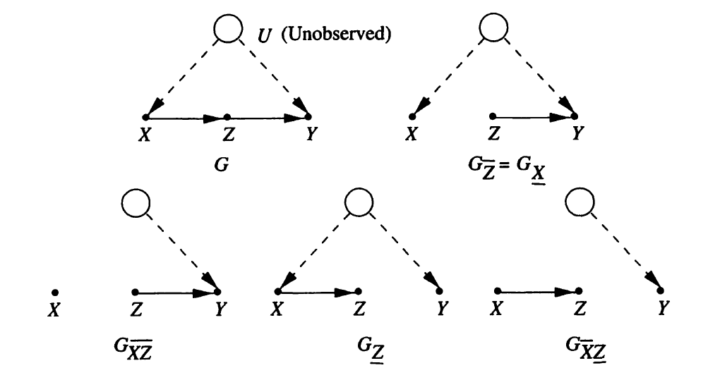

```{r setup, include=FALSE}
knitr::opts_chunk$set(echo = TRUE,
                      eval = TRUE,
                      warning = FALSE,
                      message = FALSE,
                      comment = "",
                      fig.height = 10,
                      fig.width = 10,
                      out.height = 300,
                      out.width = 300)
options(dplyr.print_max = 1e9)
```


# 3.1. はじめに {#first_of_all}
\newcommand{\indep}{\mathop{\,\perp\!\!\!\!\!\perp\,}}
\newcommand{\notindep}{\mathop{\,\perp\!\!\!\!\!/\!\!\!\!\!\perp\,}}
\newcommand{\mat}[1]{\begin{pmatrix} #1 \end{pmatrix}}
\usepackage{color}
\usepackage{amsmath}


## 本章の目的 {#puropose}

* 対象とする研究領域において適切であると考えられる定性的な因果的仮定とデータを組み合わせることによって、因果関係を学習する方法論
* 因果グラフを既知と仮定した上で、因果関係の大きさを評価
* データ生成過程が潜在変数を含まないDAGで記述されている場合、非実験データから介入効果を推定できる
  * 非観測変数が存在する場合、識別問題が生じる
  * 因果ダイアグラムによる簡便な検証法を用いると、因果効果が識別可能か判断できる
* do計算法の導入
  * 介入変数と観測変数からなる数式表現を、他の数式表現へ変換する規則
* 構造方程式と回帰方程式の区別
* 直接効果と間接効果の定義
* 構造方程式とNeyman-Rubinモデルとの関係

## 扱う問題の例 {#example1}

* 土壌燻蒸剤($X$)により、線虫の個体数($Z$)を制御することによって、オート麦の収穫量($Y$)を増やすという実験
* 土壌燻蒸剤は、収穫量に対しても直接的な影響を与えている
* 土壌燻蒸剤は、昨年の線虫の個体数($Z_0$)に基づいて決定している
* $X$から$Y$への因果効果を知りたい

## 扱う問題の因果グラフ {#example1_graph}

<div class="column1">
* Z_0：昨年の線虫数
* Z_1：燻蒸前の線虫数
* Z_2：燻蒸後の線虫数
* Z_3：季節終わりの線虫数
* B：線虫の捕食者の個体数
* ○は非観測変数、□は観測変数
</div>

<div class="column2">
```{r, echo=FALSE}
library(DiagrammeR)
grViz("3_1.dot")
```
</div>


## 本章でわかること

* (先の例の続き)
* $X$から$Y$への因果効果は、$Z, Z_1, Z_2, Z_3, Y$の観測分布に基づいて一致推定できる
* (すべての変数が離散型確率変数である場合には)$X$から$Y$への因果効果は、以下で与えられる

$$
P(y|do(x)) = \sum_{z_1} \sum_{z_2} \sum_{z_3} P(y | z_2, z_3, x) P(z_2 | z_1, x) \sum_{x'} P(z_3 | z_1, z_2, x')P(z_1, x')
$$

* $Y$と$Z_3$が交絡している場合には、$X$から$Y$への因果効果の一致推定量を得ることはできないが、$Z_2$と$Y$が交絡していても$P(y|do(x))$の一致推定量を得ることができる


# 3.2. マルコフ・モデルに基づく介入
## 介入を表現するモデルとしてのグラフ {#intervention_graph}

* DAGについての因果的理解
  * 対応する変数間の**自律的な関数関係**によって表現できる
  * 自律的：ある方程式に影響を与える外部変化が起こっても、他の方程式は変わらない

$$
x_i = f_i(pa_i, \epsilon_i), \quad i = 1,\ldots ,n
$$

* $pa_i$は$X_i$の親集合
* 誤差変数$\epsilon_i$は解析に取り入れられない背景因子
  * 誤差変数は互いに独立であり、任意の分布に従う
  * 背景因子が複数の変数に影響を与える(誤差変数同士が独立でない)場合は、その背景因子は非観測変数として解析に取り入れられる
* より一般的な因果モデルは、
$$
x_i = f_i(pa_i, u_i), \quad i = 1,\ldots ,n
$$

  * 背景因子の集合 $U$：すべての非観測因子($\epsilon_i$を含む)の集合
  * 上記の関数関係の集合と背景因子の同時分布$P(u)$で表現できる

## 例：因果グラフの関数表現

<div class="column1">
$$
Z_0 = f_0(\epsilon_0) \\
Z_1 = f_1(Z_0, \epsilon_1) \\
Z_2 = f_2(X, Z_1, \epsilon_2) \\
Z_3 = f_3(B, Z_2, \epsilon_3) \\
B = f_B(Z_0, \epsilon_B) \\
X = f_X(Z_0, \epsilon_X) \\
Y = f_Y(X, Z_2, Z_3, \epsilon_Y)
$$
</div>

<div class="column2">
```{r, echo=FALSE}
library(DiagrammeR)
grViz("3_1.dot")
```
</div>

## 原子的な介入

* ある関数集合に対して、それ以外の関数集合を変えること無く、その関数集合全体を変化させる行為を介入とみなす
* 介入によって変化したメカニズムの特徴を識別できれば、介入効果を予測することができる
* 最も簡単な介入方式は、**単一変数$X_i$を定数$x$に固定する**というもの
  * これを**原始的な介入**という
  * $do(x_i)$または$do(X_i = x_i)$と表現する

<div class="column1">
* 介入**前**の関数集合
$$
Z_0 = f_0(\epsilon_0) \\
Z_1 = f_1(Z_0, \epsilon_1) \\
Z_2 = f_2(X, Z_1, \epsilon_2) \\
Z_3 = f_3(B, Z_2, \epsilon_3) \\
B = f_B(Z_0, \epsilon_B) \\
X = f_X(Z_0, \epsilon_X) \\
Y = f_Y(X, Z_2, Z_3, \epsilon_Y)
$$
</div>

<div class="column1">
* $X$に介入**後**の関数集合
$$
Z_0 = f_0(\epsilon_0) \\
Z_1 = f_1(Z_0, \epsilon_1) \\
Z_2 = f_2(\color{red}{x_i}, Z_1, \epsilon_2) \\
Z_3 = f_3(B, Z_2, \epsilon_3) \\
B = f_B(Z_0, \epsilon_B) \\
X = \color{red}{x_i} \\
Y = f_Y(\color{red}{x_i}, Z_2, Z_3, \epsilon_Y)
$$
</div>

## 因果効果(定義3.2.1) {#def_causal_effect}
<div class="box">
互いに排反な集合$X$と$Y$に対して、$X$の実現値$x$に対して、
$x_i = f_i(pa_i , u_i)$のモデルから$X$の要素を左辺にもつ方程式をすべて取り除き、
それ以外の方程式の右辺にある$X$を$x$と置き換えることによって得られる$Y=y$の確率を$P(y|do(x))$と記す。
この時、$X$から$Y$の確率分布の空間への関数$P(y|do(x))$を$X$から$Y$への因果効果という
</div>

* 介入によって得られる方程式集合に対するグラフは、$X$へ向かう矢線すべてをグラフから取り除いた部分グラフ
* 期待値の差$E(Y|do(x')) - E(Y|do(x''))$を因果効果の定義とすることもある
  * この差は$P(y|do(x))$から計算することができる

## 変数としての介入 {#intervention_variable}

* 介入を行う力をモデルに含まれる変数とみなすことで、介入を説明することもできる
* 関数$f_i$を変数$F_i$の実現値として表現する

$$
x_i = I(pa_i, f_i, u_i) \\
I は、b = f_i であるときに \quad I(a,b,c)=f_i(a,c) \quad を満たす関数
$$

* 例えば、原子的介入の場合、$F_i$は${do(x_i', idle)}$のどちらかの値をとる変数として、グラフに$F_i \rightarrow X_i$を加える
  * $x_i'$は$X_i$が取りうる値、"idle"は介入を行わないことを表す
* このように、介入を変数として表現することで、親変数に依存した介入などの複雑な介入でも表現できるようになる

## 変数としての介入のグラフ {#intervention_variable_graph}


$$
P(x_i|pa_i') = \begin{cases}
P(x_i|pa_i) \quad F_i = {\rm idle} のとき \\
0 \quad F_i = do(x_i')かつx_i \neq x_i' のとき \\
1 \quad F_i = do(x_i')かつx_i = x_i' のとき
\end{cases}
$$

$$
P(x_1,\ldots ,x_n|do(x_i')) = P'(x_1,\ldots ,x_n|F_i = do(x_i'))
$$


## 介入効果の計算 {#intervention_calc}

* 原子的介入は、因果効果の定義より、以下のように表現できる

$$
P(x_1,\ldots ,x_n|do(x_i')) = \begin{cases}
\Pi_{j \neq i} P(x_j|pa_j) \quad x_i = x_i' のとき \\
0 \quad x_i \neq x_i' のとき
\end{cases}
$$

* $pa_i$は$X_i$に影響を与えないので、切断的因数分解より$P(x_i|pa_i)$の項が取り除かれている
  * $P(x_i|pa_i)=1$である
* $P(x_i|pa_i)$を式から取り除くことと、$PA_i$から$X_i$の矢線をグラフから取り除く(それ以外は変えない)ことは同値である
  * 次のページの例で説明

## 例：介入のグラフと式の関係 {#interventin_graph_equ}

<div class="column1">
```{r, echo=FALSE}
grViz("3_1.dot")
grViz("3_2.dot")
```
</div>

<div class="column2">
* 介入前
$$
\begin{align*}
P&(z_0,z_1,b,z_2,z_3,x,y) \\
= &P(z_0)P(z_1|z_0)P(b|z_0) \\
&P(x|z_0)P(z_2|x,z_1) \\
&P(z_3|z_2,b)P(y|x,z_2,z_3)
\end{align*}
$$

* 介入後
$$
\begin{align*}
P&(z_0,z_1,b,z_2,z_3,x',y) \\
= &P(z_0)P(z_1|z_0)P(b|z_0) \\
&P(z_2|x',z_1) \\
&P(z_3|z_2,b)P(y|x',z_2,z_3)
\end{align*}
$$
</div>

## 介入前の分布との関係 {#intervention_before_after}

* 介入前後の分布の関係性は、前々頁の式を$P(x_i'|pa_i)$で割ることで表現できる

$$
\begin{align*}
P(x_1,\ldots ,x_n|do(x_i')) &= \frac{\Pi_{j \neq i} P(x_j|pa_j) P(x_i'|pa_i)}{P(x_i'|pa_i)} \\
&= \frac{\Pi_{j} P(x_j|pa_j)}{P(x_i'|pa_i)} \\
&= \frac{P(x_1,\ldots ,x_n)}{P(x_i'|pa_i)}
\end{align*}
$$

* $x_i \neq x_i'$のときは省略
* 状態を表す抽象的な点$(x_1,\ldots ,x_n)$全体に重みを割り当てたものを同時分布としてみなすと、
  上記の式から、介入$do(x_i')$は重みの分布を変化させるものと解釈できる

## さらなる式展開 {#intervention_expansion}

$$
\begin{align*}
P(x_1,\ldots ,x_n|do(x_i')) &= \frac{P(x_1,\ldots ,x_n)}{P(x_i'|pa_i)} \\
&= \frac{P(x_1,\ldots ,x_n | x_i', pa_i)P(x_i', pa_i)}{P(x_i'|pa_i)} \\
&= \frac{P(x_1,\ldots ,x_n | x_i', pa_i)P(x_i'| pa_i)P(pa_i)}{P(x_i'|pa_i)} \\
&= P(x_1,\ldots ,x_n | x_i', pa_i)P(pa_i)
\end{align*}
$$

## 直接原因による調整(定理3.2.2) {#theo_dir_cause}

<div class="box">
$PA_i$を$X_i$の直接原因からなる集合、$Y$を${X_i \cup PA_i}$と互いに排反な任意の変数集合とする。

介入$do(x_i')$の$Y$への効果は以下で与えられる。

$$
P(y|do(x_i')) = \sum_{pa_i} P(y|x_i', pa_i)P(pa_i)
$$
</div>

* $P(y|x_i', pa_i)$と$P(pa_i)$は介入前の確率を表す
* $X$の親を$P(y|x_i')$に条件づけた上で、$PA_i=pa_i$の事前確率で重みを付けて、その結果を平均化している
* この条件づけ&平均化で定義された操作を**$PA_i$による調整**と呼ぶ

## ここまでの具体例 {#intervention_example1}

<div class="column3">

```{r, echo=FALSE}
grViz("3_3.dot")
```

</div>

<div class="column4">

* 介入前

$$
\begin{align}
&P(x,y,z_1,z_2) \\
&= P(y|x,Z_1,Z_2)P(x|z_2)P(z_2|z_1)P(z_1)
\end{align}
$$


* 介入後

$$
\begin{align}
&P(y,z_1,z_2|do(x')) \\
&= P(y|x',Z_1,Z_2)P(z_2|z_1)P(z_1)
\end{align}
$$

</div>

* $Y$の周辺分布を考えることで以下が得られる(因果効果)

$$
P(y|do(x')) = \sum_{z_1, z_2}P(y|x', z_1, z_2)P(z_1, z_2)
$$

## ここまでの具体例(つづき) {#intervention_example2}

* $Z_2$が$X$と$Z_1$を有向分離している
  * $Z_1 \indep X | Z_2$ が成立
  * つまり、$P(z_1|z_2) = p(z_1|x, z_2)$が成立

$$
\begin{align}
P(y|do(x')) &= \sum_{z_1, z_2}P(y|x', z_1, z_2)P(z_1, z_2) \\
&= \sum_{z_1,z_2}P(y|x', z_1,z_2)P(z_1|z_2)P(z_2) \\
&= \sum_{z_1,z_2}P(y|x', z_1,z_2)P(z_1|x', z_2)P(z_2) \\
&= \sum_{z_2}P(y|x', z_2)P(z_2)
\end{align}
$$

* 因果効果は$Z_1$の値に依存しないことがわかる
* この因果グラフにおいて、$Z_1$が観測できなくても、$X$から$Y$の因果効果を評価できる


## 平均因果効果の導出 {#average_causal_effect}

* 定理3.2.2より、$Y$の期待値を定義することができる
* 以下をを$X_i=x_i'$から$Y$への**平均に対する因果効果**と呼ぶ

$$
E(Y|do(x_i')) = \sum_y y \times P(y|do(x_i'))
$$

* 以下を、$x_i'$と$x_i''$を比較したときの$X$から$Y$への**平均的因果効果**と呼ぶ
  * 平均に対する因果効果との区別が紛らわしいので、**因果リスク差**と呼ぶこともある
  
$$
E(Y|do(x_i')) - E(Y|do(x_i''))
$$


## 因果効果の定義の拡張 {#causal_effect_2}

* 前頁の定理は、原子的介入のみに対するもの
* 介入は原子的なものに限定されない
  * 共変量の値に応じて処理変数の値を変える**条件付き介入**
  * 確率的に処理変数の値を変化させる**確率的介入**

* 複数の変数に同時に介入した場合
  * $S$を変数の部分集合であるとし、同時介入$do(S=s)$を行う

$$
P(x_1,\ldots ,x_n|do(s)) = \prod_{i|X_i \notin S} P(x_i|pa_i)
$$

* 新しい変数集合$PA_i^*$を含む方程式で$X_i$の値を決定するメカニズムを置き換える場合
  * 修正された同時分布は$P(x_i|pa_i)$を$P^*(x_i|pa_i^*)$で置き換えることで得られる

$$
P^*(x_1,\ldots ,x_n) = \frac{P(x_1,\ldots ,x_n)P^*(x_i|pa_i)}{P(x_i|pa_i)}
$$


## 例:工程管理 {#eg_1}

* 変数$Z_k$を時間$t_k$における生産工程の状態
* $X_k$を工程を制御するために使われる変数の集合
* $X_k$を決定する計画$S$
  * $X_k$を観測する前に変数$(X_{k-1}, Z_k, Z_{k-1})$をモニタリング
  * 確率$P(x_k|x_{k-1}, z_k, z_{k-1})$に基づいて$X_k = x_k$を選択する
* 結果変数は$Y$
* $X_k$を新しい条件付き確率$P^*(x_k|x_{k-1}, z_k, z_{k-1})$に従って選択するという新しい計画$S^*$に変えることの評価を行う


## 例:工程管理(つづき1) {#eg_2}

$$
\begin{align}
P^*(y) &= \sum_{z_1,\ldots ,z_n,x_1,\ldots ,x_n} P^*(y,z_1,\ldots ,z_n,x_1,\ldots ,x_n) \\
&= \sum_{z_1,\ldots ,z_n,x_1,\ldots ,x_n} P(y|z_1,\ldots ,z_n,x_1,\ldots ,x_n) \\
&\times \prod_{k=1}^n P(z_k|z_{k-1},x_{k-1}) \prod_{k-1}^n P^*(x_k|x_{k-1},z_k,z_{k-1})
\end{align}
$$

* $S^*$が決定論的でかつ時間に不変である場合、$X_k$は以下の関数で規定される

$$
x_k = g_k(x_{k-1},z_k,z_{k-1})
$$

よって、この時、$x_1,\ldots ,x_n$について和をとることで、以下を得る

$$
\begin{align}
P^*(y) &= \sum_{z_1,\ldots ,z_n} P(y|z_1,\ldots ,z_n,g_1,\ldots ,g_n) \\
&\times \prod_{k=1}^n P(z_k|z_{k-1},g_{k-1})
\end{align}
$$

## 例:工程管理(つづき2) {#eg_3}

* 特別な場合として、計画$S^*$が原子的介入$do(x_k)$から構成されるときには、関数$g_k$は定数$x_k$となり、以下を得る

$$
\begin{align}
P^*(y) &= P(y|do(x_1),\ldots ,do(x_n)) \\
&= \sum_{z_1,\ldots ,z_n} P(y|z_1,\ldots ,z_n,x_1,\ldots ,x_n) \\
&\times \prod_{k=1}^n P(z_k|z_{k-1},x_{k-1})
\end{align}
$$


## ここまでのまとめ {#conc_1}

* 介入が行われる変数の直接原因（親）がすべて観測された因果ダイアグラムが与えられたとき、
  介入前の分布から介入後の分布を推測できる
  * つまり、このような仮定の元では、非実験的な観察データから切断分解公式を用いて介入効果を推定できる
* 以降では、$PA_i$のいくつかの要素が観測できない状況の下での因果効果について扱う
  * $P(x_j|do(x_i'))$がどのような場合に推定可能であるかを判断するためのグラフィカル検証法を紹介する
* まずは、受動的観測データから推定される因果的量$Q$の意味について定義する
  * **識別可能性**という用語で記述される問題を形式的に定義する

# 3.2.4. 因果的量の識別可能性

## 因果的量 {#causal_quantity}

* 因果的量は、因果モデル$M$によって定義されるものである
  * 観測変数集合$V$の同時分布$P_M(v)$で定義されるものではない
* 非実験データは$P_M(v)$のみに関する情報を与えるだけで、興味のある量をデータから識別できない危険性がある
  * なぜなら、複数の因果モデルにより同じ分布が生成できるため
* 識別可能条件は、因果モデル$M$を十分に説明できない場合、ある仮定を加える事によって、
  欠測した情報を埋めることができることを保証するもの
  
## 識別可能性(定義3.2.3) {#Identifiability}

<div class="box">
$Q(M)$をモデル$M$において計算可能な量とする。

モデルのクラス$M$から得られる任意のモデル$M_1$と$M_2$に対して、$P_{M_1}(v)=P_{M_2}(v)$が成り立つ場合はいつでも
$Q(M_1)=Q(M_2)$であるとき、モデル$M$において$Q$は識別可能であるという。

観測変数が限定され、$P_M(v)$の部分集合$F_M$が推定可能である場合、$F_{M_1}=F_{M_2}$が成り立つときはいつでも
$Q(M_1)=Q(M_2)$であるとき、$Q$は$F_M$から識別可能であると定義する。
</div>

* 識別可能であれば、$M$について詳しく規定しなくても、$P(v)$に関する標本に基づいて$Q$の一致推定を得られる

## 因果効果の識別可能性(定義3.2.4) {#identifiability_causal_effect}

* 因果効果の定義より、モデル$M$から因果効果は計算できる
  * しかし、$M$が十分に規定されない場合でも、$M$に関連するグラフ$G$によって記述された特徴を用いて因果効果を計算しなければならないこともある

1. 同じ親子関係（すなわち、同じ因果グラフ$G$）をもつ
1. 観測変数は正値分布に従う（すなわち、$P(v)>0$）

という特徴を持つモデル$M$のクラスについて次の定義を与える

<div class="box">
量$P(y|do(x))$が正値である任意の観測変数の分布から一意に計算できる、すなわち、
$P_{M_1}(v)=P_{M_2}(v)>0$かつ$G(M_1)=G(M_2)=G$なる全てのモデルの組$M_1$と$M_2$に対して、
$P_{M_1}(y|do(x))=P_{M_2}(y|do(x))$が成り立つとき、$X$から$Y$への因果効果はグラフ$G$において識別可能であるという。
</div>

## 余談:因果効果の識別可能性 {#identifiability_causal_effect_2}

* 識別可能性の定義、わかりづらくないですか？

$$
P_{M_1}(v)=P_{M_2}(v)\\
\Rightarrow Q(M_1)=Q(M_2) \\
$$

とか

$$
P_{M_1}(v)=P_{M_2}(v)>0 \text{　かつ、} G(M_1)=G(M_2)=G \\
\Rightarrow P_{M_1}(y|do(x))=P_{M_2}(y|do(x))
$$

* 対偶で考えよう

$$
P_{M_1}(y|do(x)) \neq P_{M_2}(y|do(x)) \\
\Rightarrow 
P_{M_1}(v) \neq P_{M_2}(v)>0 \text{　または、} G(M_1) \neq G,  G(M_2) \neq G
$$

* 「因果効果が異なるならば、観測変数の分布が異なる or グラフが異なる」が成立すると識別可能である
* 「因果効果が異なるのに、観測変数の分布が同じ and グラフが同じ」だと、識別可能でない

## 因果効果の識別可能性(つづき) {#identifiability_causal_effect_3}

$P(y|do(x))$が識別可能である時

  1. 観察データから得られた同時確率分布$P(v)$
  1. どのような変数が各変数の値を決定するのに関与しているかを規定している因果グラフ$G$

という2つの情報源に基づいて、介入$do(x)$から$Y$への効果を推測できることが保証される

* 制約は、データ生成過程$M_1$と$M_2$がともに同じ因果グラフ$G$と同時分布$P(v)$を持つことのみ
  * $M_1$と$M_2$が異なっていてもOK、詳細に記述されてなくてもOK
* 識別不能で有ることを証明するためには、観測変数についてまったく同じ分布を引き起こすが、
  異なる因果効果を持つ構造方程式が2つ存在することを示せば良い


<!-- ## 例:因果効果の識別可能性 {#identifiability_eg} -->

<!-- * $X$と$\epsilon_y$は独立に平均0、分散1とする正規分布に従う -->
<!-- * 以下の2つのデータ生成過程$M_1$と$M_2$を考える -->

<!-- $$ -->
<!-- M_1 : Y = X + \epsilon_y \\ -->
<!-- M_2 : Y = X - \epsilon_y -->
<!-- $$ -->

<!-- * 因果グラフは2つとも $X \rightarrow Y$ である -->
<!-- * 同時分布は、平均0、$Y$の分散$\sigma_{yy} =2$、$X$と$Y$の共分散$\sigma_{xy}=1$の正規分布になる -->
<!-- * つまり$M_1$と$M_2$は同じクラスに属する -->


## マルコフモデルの因果効果の識別可能性 {#identifiability_malkov_model}

<div class="box">
定理3.2.5

変数の部分集合$V$が観測されているマルコフモデルに対応する因果グラフ$G$において、
${X \cup Y \cup PA_X} \subseteq V$、すなわち、$X,Y$と$X$のすべての親集合が観測されている時、
因果効果$P(y|do(x))$は識別可能であり、$PA_X$で調整することによって、計算することができる
</div>

* マルコフモデルとは、背景因子が独立で、グラフ$G$が非巡回的であるモデルのこと
* 今後は、セミマルコフモデルにおける識別問題に注目する

# 3.3. 交絡因子の制御 {#control_confounding}

## はじめに {#first_of_all_confounding}

* ある要因$X$からもう1つの要因$Y$への効果を評価する場合、交絡因子と呼ばれる要因$Z$の変動を調整すべきかという問題が生じる
  * 調整とは、母集団を$Z$について等質なグループに分割し、各グループの因果効果を評価&平均化すること
  * シンプソンのパラドックス(詳細は省略)
* Rosenbaum and Rubinは、潜在反応モデルを用いて、**無視可能性**を提案
  * $Z$を与えた時、$X$が$x$という値をとった場合に$Y$が取り得る値が$X$と独立であるならば、$Z$は許容可能な共変量集合である
  * どの変数で調整すればよいか？までは分からない
* 本節では、因果グラフを使って、調整問題に対する一般的かつ形式的解を与える
  * バックドア基準・フロントドア規準

## 非交絡(定義) {#no_confouding}

<div class="box">
排反な2つの集合$X,Y \subseteq V$に対して、

$$
P(y|do(X = x)) = P(y|X = x)
$$

が成り立つ時、$X$から$Y$への因果効果は交絡しないという
</div>

* $P(y|do(X = x)) \neq P(y|X = x)$ であるとき、$X$と$Y$は交絡するということになる
* 因果効果を識別可能とする十分な共変量集合を**十分な交絡因子**と呼ぶ
* 十分な交絡因子に属する共変量を**交絡因子**と呼ぶ
* 共変量集合$\bf{Z}$を導入して、${\bf Z} = {\bf z}$を与えた時に$X$と$Y$は交絡しないということもある

$$
P(y|do(X = x, {\bf z} )) = P(y|X = x, {\bf z})
$$


## バックドア基準(定義3.3.1) {#backdoor}
* 交絡する場合、$X$の親変数で調整すれば、$Y$への因果効果を識別できることを前節で理解した
* しかしグラフには変数の親が含まれていたとしても、測定されないために観測値が手に入らないということもある
  * この場合に因果効果を識別するには、別の変数の集合について調整する必要がある
* バックドア基準を因果グラフに適用することで、
  変数集合$Z \subseteq V$が$P(y|do(x))$を識別するのに十分であるかどうかを検証することができる

## バックドア(定義3.3.1) {#def_backdoor}

<div class="box">
DAG $G$において、次の条件を満たす変数集合$Z$は順序対$X_i, X_j$についてバックドア基準を満たすという

1. $Z$の任意の要素は$X_i$の子孫ではない
1. $Z$は$X_i$に向かう矢線を含む道で、$X_i$と$X_j$を結ぶものすべてを有向分離する

同様に、$X$と$Y$が$G$における互いに排反な頂点集合である時、$Z$が任意の$X_i \in X$と$X_j \in Y$に対してバックドア基準を満たすならば、
$Z$は$X$と$Y$についてバックドア基準を満たすという
</div>

* $PA(X_i)$は必ずバックドア基準を満たす
* $PA(X_i)$以外にもバックドア基準を満たす変数集合が存在しうる

## 例:バックドア基準 {#eg_backdoor}

<div class="column3">

</div>

<div class="column4">
* バックドア基準を**満たす**集合
  * $\{ X_3, X_4 \}$
  * $\{ X_4, X_5 \}$

* バックドア基準を**満たさない**集合
  * $\{ X4 \}$
</div>

## 例:バックドア基準{dagitty} {#eg_backdoor_dagitty_code1}

```{r}
library(dagitty)
g <- dagitty( 'dag {
    X1 [pos="0,0"]
    X2 [pos="2,0"]
    X3 [pos="0,1"]
    X4 [pos="1,1"]
    X5 [pos="2,1"]
    X6 [pos="1,2"]
    Xi [pos="0,2"]
    Xj [pos="2,2"]
    
    X1 -> X3 -> Xi -> X6 -> Xj
    X1 -> X4 -> Xi
    X2 -> X4 -> Xj
    X2 -> X5 -> Xj
}')
```


## 例:バックドア基準{dagitty} {#eg_backdoor_dagitty_code2}


```{r, echo=FALSE, fig.width = 5, fig.height = 4, out.width = '50%'}
plot(g)
```

```{r}
adjustmentSets(g, "Xi", "Xj", type = "minimal")
```


## バックドア調整(定理3.3.2) {#theo_backdoor}

<div class="box">
変数集合$Z$が$(X,Y)$についてバックドア基準を満たすならば、$X$から$Y$への因果効果は識別可能であり、以下で与えられる

$$
P(y|do(x)) = \sum_z P(y|x,z)P(z)
$$
</div>

* 上記が成り立つ時、Rosenbaum and Rubin(1983)は、「$Z$を与えたときに条件付き無視可能である」といっている
  * 無視可能性とは「$Z$を与えたとき、$X$が$x$という値をとった場合に$Y$が取るであろう値が$X$と独立であるならば、$Z$は許容可能な共変量集合である」というもの
  * $X \indep \{Y(0),Y(1) \} |Z$
* グラフの大小や形には関係なく、システマティックな手続きを用いて、
  最適な共変量集合(標本変動や測定コストを最小にする集合$Z$)を探索ることができる
* 因果効果を識別可能とする十分な共変量集合を**十分な交絡因子**と呼ぶ
  * 十分な交絡因子に属する共変量を**交絡因子**と呼ぶ


## 証明:バックドア調整 {#proof_backdoor}

$Z$が$X$から$Y$へのすべてのバックドアパスをブロックしている時、
$X=x$を条件付けることと、$X=X$と固定することが$Y$に対して同じ影響を与えるという解釈で証明を進める。

変数による介入を考え、$F_x \rightarrow X$が加えられた拡張グラフ$G'$を見ると、
$X$から$Y$へのバックドアパスがすべてブロックされているならば、$F_x$から$Y$へのすべての道は$X$の子を経由していなければならない。

この時、$X$を与えた時に$Y$と$F_X$とは独立である。

$$
P(y|x, F_X =do(x)) = P(y |x, F_X = idle) = P(y|x)
$$

つまり、$X=x$ と $F_X=do(x)$が一致する。

因果効果は、$G'$による拡張確率関数に基づいて以下の様に表現できる。

$$
\begin{align}
P(y|do(x)) &= P'(y|F_x) \\
&= \sum_z P'(y|z,F_x)P'(z|F_x) \\
&= \sum_z P'(y|z,x,F_x)P'(z|F_x)
\end{align}
$$

## 証明:バックドア調整(つづき) {#proof_backdoor2}

* 前頁の右辺から$F_x$を取り除くために、バックドア基準の定義を適用する
* $F_x$は$X$を子とするルートであるから、$Z$を含む$X$の非子孫すべてと独立でなければならない(条件1)

$$
P'(z|F_x) = P'(z) = P(z)
$$

* 前頁より$P(y|x, F_x)=P(y|x)$が成り立つ
* よって、$P'(y|z,x,F_x) = P(y|x,z)$となる

すなわち
$$
P(y|do(x)) = \sum_z P(y|x,z)P(z)
$$


# 3.3.2. フロントドア基準

## フロントドア基準の直感的理解 {#frontdoor_intuition}

* バックドア基準により、観察データから因果効果を推定する場合に、どの変数について調整すればよいか判断できる(前節)
* しかし、バックドア基準だけで因果効果を推定する方法をすべて見つけることができるわけではない
* フロントドア基準を導入することで、処理変数の影響を受ける変数を使って因果効果を推測する(本節)

## 例)フロントドア基準の直感的理解 {#frontdoor_intuition_eg1}

<div class="column3">


</div>

<div class="column4">
* 上図で$X_1,\cdots,X_5$が非観測の場合を考える
* $\{X_i, X_6, X_j\}$を$\{X,Z,Y\}$とおく <br> → 下図


* 下図では$Z$はバックドア基準を満たしていないが、$Z$を観測することで$P(y|do(x))$の一致推定量を得られる
* バックドア基準を2回使うイメージ
  * $X$から$Z$へのバックドアパスは存在しないので、$X\rightarrow Z$は識別可能
  * $X$を条件付けることでバックドアパスを閉じれるので、$Z \rightarrow Y$は識別可能
</div>

## フロントドア基準 {#frontdoor_1}

* 前頁の下図の同時分布は、以下と分解できる

$$
P(x,u,z,u) = P(u)P(x|u)P(z|x)P(y|z,u)
$$

* この時、介入$do(x)$によって$P(x|u)$を除去できる

$$
P(y,z,u|do(x)) = P(u)P(z|x)P(y|z,u)
$$

* ここで、$z$と$u$について和を取る(周辺化)

$$
P(y|do(x)) = \sum_z P(z|x) \sum_u P(y|z,u)P(u)
$$

## フロントドア基準(つづき) {#frontdoor_2}

* グラフから得られる2つの条件付き独立関係

$$
P(u|z,x) = P(u|x) \\
P(y|x,z,u) = P(y|z,u)
$$

* 上記の独立関係を利用して、$u$を取り除く

$$
\begin{align*}
\sum_u P(y|z,u)P(u) &= \sum_x \sum_u P(y|z,u)P(u|x)P(x) \\
                    &= \sum_x \sum_u P(y|x,z,u)P(u|x,z)P(x) \\
                    &= \sum_x P(y|x,z)P(x)
\end{align*}
$$

## フロントドア基準(つづき) {#frontdoor_3}

* よって、観察可能な量だけを含む式を得る

$$
P(y|do(x)) = \sum_z P(z|x) \sum_{x'} P(y|x',z)P(x')
$$

* 上記の独立関係が成り立つ中間変数$Z$を見つけられれば、$X \rightarrow Y$の因果効果に対する識別可能なノンパラメトリック推定量を得られる
* 上式の解釈：バックドア基準の2段階適用
  * $X$から$Z$へのブロックされないバックドアパスがないので、$P(z|do(x)) = P(z|x)$
  * $X$はバックドアパス $Z \leftarrow X \leftarrow U \rightarrow Y$ を有向分離するので、
    $P(y|do(z)) = \Sigma_{x'}P(y|x',z)P(x')$
  * 2つの因果効果を結合 $P(y|do(x))=\sum_zP(y|do(z))P(z|do(x))$


## フロントドア基準 {#def_frontdoor}

<div class="box">
定義3.3.3

次の条件を満たす変数集合$Z$は順序対$(X,Y)$についてフロントドア基準を満たすという

1. $Z$は$X$から$Y$へのすべての有向道を切断する
1. $X$から$Z$へのブロックされないバックドアパスはない
1. $Z$から$Y$へのバックドアパスは、全て$X$によってブロックされる
</div>

* 実際の応用場面を想定した場合、条件2,3は非常に厳しい

## フロントドア調整 {#theo_frontdoor}

<div class="box">
定理3.3.4

変数集合$Z$が$(X,Y)$についてフロントドア基準を満たし、かつ$P(x,z)>0$とする。
この時、$X$から$Y$への因果効果は識別可能であり、以下で与えられる。

$$
P(y|do(x)) = \sum_z P(z|x) \sum_x' P(y|x',z)P(x')
$$
</div>

* 数頁前で証明済

## 例)喫煙と遺伝子型の理論 {#eg_frontdoor_1}

<div class="column3">
```{r, echo=FALSE}
grViz("3_4.dot")
```

</div>

<div class="column4">
仮定

* 喫煙はタールの蓄積量を通してのみ肺ガンに影響
* 遺伝子は肺ガンの発症を促進するが、タールの蓄積量には間接的にのみ影響
* タールの蓄積量と喫煙の両方に影響を与える要因はない
* タールの蓄積量は喫煙以外の要因によっても高くなる一方で、タールが蓄積されない喫煙者もいる$(P(x,z)>0)$
</div>

## 例)喫煙と遺伝子型の理論 {#eg_frontdoor_2}

```{r, echo=FALSE}
library(readxl)
library(dplyr)
d <- read_excel("data/3_3_3.xlsx")
head(d, 4) %>% 
  DT::datatable(extensions = 'FixedColumns',
  options = list(
    dom = 't',
    scrollX = TRUE,
    scrollCollapse = TRUE
  ))
```

* タバコ業界は喫煙は肺ガンのリスクを減少させると主張
  * 喫煙した場合にタールの蓄積量が増加する可能性は、非喫煙の場合より高い
  * 喫煙者グループでも非喫煙者グループでも、タール蓄積量が多いほうが肺ガンリスクが低い
* 次頁でフロントドア基準を適用して、喫煙の肺ガンリスクへの因果効果を計算

## 例)喫煙と遺伝子型の理論 {#eg_frontdoor_3}

$$
P(y|do(x)) = \sum_z P(z|x) \sum_{x'} P(y|x',z)P(x')
$$

$$
\begin{align*}
P(Y=1|do(X=1)) &=  0.05 (0.1 \times 0.5 + 0.9 \times 0.5) \\
               &\quad + 0.95 (0.05 \times 0.5 + 0.85 \times 0.5) \\
               &=  0.05 \times 0.5 + 0.95 \times 0.45 \\
               &=  0.4525 \\
\\
P(Y=1|do(X=0)) &= 0.95 (0.1 \times 0.5 + 0.9 \times 0.5) \\
               &\quad + 0.05 (0.05 \times 0.5 + 0.85 \times 0.5) \\
               &= 0.95 \times 0.5 + 0.05 \times 0.45 \\
               &= 0.4975
\end{align*}
$$

## 識別可能条件の選択問題 {#backdoor_frontdoor}

* $U$も$Z$も観測できる場合、バックドア基準とフロントドア基準のどちらを用いるべきか？
* バックドア基準を用いた場合、処理変数と反応変数の間に**直接的な因果関係**があっても無くても因果効果は識別可能
* 処理変数と反応変数の間に**直接的な因果関係**がある場合、フロントドア調整で因果効果を推定しようとするとバイアスが生じる
  * なぜなら条件1を満たしていない
  * 条件1：$Z$は$X$から$Y$へのすべての有向道を切断する
* 「直接的な因果関係がない」と主張するためには強い根拠が必要になる
* できればバックドア基準を用いたほうが良い


## 擬フロントドア基準 {#frontdoor_like}

* フロントドア基準の条件2,3は非常に厳しい
* しかし、条件2,3を以下に置き換えることで、フロントドア基準を一般化できる

<div class="box">
2. $X$から出る矢線をすべて取り除いたグラフにおいて、$X$の非子孫からなる集合$Z$は$X$と$S$の任意の要素を有向分離する
3. $S$の任意の要素から出る矢線をすべて取り除いたグラフにおいて、$S$の非子孫からなる集合$X \cup Z$は$S$の任意の要素と$Y$を有向分離する
</div>

<div class="column3">
```{r, echo=FALSE}
grViz("3_7.dot")
```
</div>

<div class="column4">
* $Z_1$と$Z_3$は非観測
* $S$はフロントドア基準もバックドア基準も満たしていない
* 置き換え後の条件2,3の$Z$に$Z_2$を対応させると、擬フロントドア基準を満たす
* つまり、$X$から$Y$への因果効果は識別可能
</div>

# 一般的識別可能条件 [黒木本](https://www.amazon.co.jp/dp/4320113179) {#general_identifiability}

## 交絡道(定義) {#def_confounding_path}

* チェックするのが比較的簡単でかつバックドア基準やフロントドア基準を包括する識別可能条件を紹介
* その前に**交絡道**を定義する必要がある

<div class="box">
因果ダイアグラム$G$上の頂点の列$\alpha_0, \alpha_1,\cdots ,\alpha_n$から構成される$\alpha_0$と$\alpha_n$の間の道で、

$$
\alpha_0 \leftrightarrow \alpha_1 \leftrightarrow \cdots \leftrightarrow \alpha_{n-1} \leftrightarrow \alpha_n
$$

のように、$i = 1,\cdots,n$に対して、$\alpha_{i-1}$と$\alpha_i$の間の道が双方向矢線
（あるいは、非観測変数で構成される双方向道で、観測変数によって有向分離されないもの）
となっているものを**交絡道**という
</div>

## 交絡道(例) {#eg_confounding_path}


## 一般的識別可能性(定理) {#theo_general_identifiability}

<div class="box">
因果ダイアグラム$G$において、$X$は$Y$の非子孫とする

$\{X,Y \}$の最小祖先集合$\text{An}(\{X ,Y\})$から生成される$G$の部分グラフにおいて、
$X$と$X$の子のそれぞれとの間に交絡道が存在しないならば、$X$から$Y$への因果効果は識別可能である
</div>

* $\text{An}(\{X ,Y\})$から生成される$G$の部分グラフを構成する際、双方向矢線$\leftrightarrow$については、
  その端点の少なくとも1つが$\text{An}(\{X ,Y\})$に含まれなければ双方向矢線そのものを取り除く
* 証明は省略([Tian and Pearl(2002)](https://ftp.cs.ucla.edu/pub/stat_ser/R290-A.pdf))
* (直感的解釈)$X$とその子の間に未観測交絡因子が存在しなければ、$X$から$Y$への因果効果は識別可能
* 識別可能であることがわかっても、どのような変数を用いれば因果効果が識別可能となるかは分からない
  * 識別可能であることを確認できた場合、後述する**do計算法**で因果効果を定式化できる
  * 因果効果が識別可能であるための十分条件だが、必要条件ではない(逆は成り立たない)

## 一般的識別可能性(例) {#eg_general_identifiability}

<div class="column3">
```{r, echo=FALSE}
grViz("3_7.dot")
```

</div>

<div class="column4">
* 上のグラフは、2つの双方向道があるが、どちらも$Z_2$によって有向分離されている
  * つまり、$Z_2$が観測可能なら、$X$と$S$の間に交絡道が無いことになり、$X$から$Y$への因果効果は識別可能
* 下の(a)〜(c)は識別不能
* 下の(d)は$\{X,Y\}$の最小祖先集合$\{X,Y\}$から生成される部分グラフは$X \rightarrow Y$のみとなり、交絡道は存在しない
  * つまり、$X$から$Y$への因果効果は識別可能
</div>

## 識別不能条件(定理) {#theo_nonidentification_condition}

<div class="box">
因果ダイアグラム$G$において、$X$は$Y$の祖先とし、$Y$の最小祖先集合を$\text{An}(Y)$とおく

$\text{An}(Y)$から生成される$G$の部分グラフにおいて、$X$との間に双方向矢線が存在するような$X$の子が存在するならば、
$X$から$Y$への因果効果は識別可能ではない
</div>

* 証明は省略([Tian and Pearl(2002)](https://ftp.cs.ucla.edu/pub/stat_ser/R290-A.pdf))

# 3.4. 介入の計算 {#calc_intervention}

## do計算法 {#do_calculus}

* 観測頂点と非観測頂点が混在した因果グラフ$G$が与えられていると仮定
* 因果効果$P(y|do(x))$を導出する構文論的方法論を与える
  * 導出とは、$P(y|do(x))$を段階的に変形することで、観測確率による同値表現を得ること
  * $do(\cdot)$をモデルに含まれる関数集合を修正するという介入と解釈
  * この解釈から得られる推論規則を**$do$計算法**という
* このような変形ができる時、$X$から$Y$への因果効果は識別可能である

## 記号 {#notation}

* $X,Y,Z$をDAG $G$の互いに排反な任意の頂点集合
* $X$に向かう矢線をすべて取り除いたグラフを$G_{\overline X}$と記す
* $X$から出る矢線をすべて取り除いたグラフを$G_{\underline X}$と記す
* $X$に向かう矢線すべてと$Z$から出る矢線すべてを除いたグラフを$G_{\overline X \underline Z}$と記す



* $X=x$と固定し、かつ$Z=z$が観測された時の$Y=y$の確率を以下と定義
$$
P(y|do(x),z) \triangleq \frac{P(y,z|do(x))}{P(z|do(x))}
$$


## do計算法 規則1：観測値の挿入・削除 {#theo_do_calc_1}

$G$を因果モデルに関するDAGとし、$P(\cdot)$をそのモデルで得られる確率分布とする。
互いに排反な任意の変数集合$X,Y,Z,W$に対して、次の規則が成り立つ

$$
(Y \indep Z| X,W)_{G_{\overline X}} \\
\Rightarrow P(y|do(x),z,w) = P(y|do(x),w)
$$

* 介入$do(x)$は、$X$とその親とを結ぶ矢線$(\rightarrow X)$を取り除く
  * 部分グラフ$G_{\overline X}$から得られる分布になる
* 有向分離性と条件付き独立性の関係と同様
  * $W$が$Y$と$Z$を有向分離するなら、$G$と整合する確率分布において$W$を与えた時$Y$と$Z$は条件付き独立
  * $(Y \indep Z|W)_G \Rightarrow P(y|z,w) = P(y|w)$

## do計算法 規則2：行動・観測値の交換 {#theo_do_calc_2}

$$
(Y \indep Z |X,W)_{G_{\overline X \underline Z}} \\
\Rightarrow P(y|do(x),do(z),w) = P(y|do(x),z,w)
$$

* $Z$から出る矢線$(Z \rightarrow)$をすべて取り除いたグラフにおいて、
  $W$が$Z$と$Y$を有向分離するなら、介入$do(z)$と観測$Z=z$が$Y$に対して同じ効果を持つ
* $W$が$Z$の非子孫であれば、バックドア基準と同様
  * $(Y \indep Z|W)_{G_{\underline Z}} \Rightarrow P(y|do(z),w) = P(y|z,w)$


## do計算法 規則3：行動の挿入・削除 {#theo_do_calc_3}

$$
(Y \indep Z |X,W)_{G_{\overline X, \overline{Z(W)}}} \\ 
\Rightarrow P(y|do(x),do(z),w) = P(y|do(x),w)
$$

* $Z(W)$は、$G_{\overline X}$において$Z$に含まれる頂点のうち、$W$に含まれる頂点の非祖先からなる集合
* $Z(W)$の頂点に向かう矢線$(\rightarrow Z(W))$をすべて取り除いたグラフにおいて、
  $W$が$Z$と$Y$を有向分離するなら、介入$do(z)$は$Y=y$の確率に影響を与えない

## 規則3の例 {#eg_do_calc_3}

<div class="column3">
* 操作前のグラフ
```{r, echo=FALSE}
grViz("3_5.dot")
```


* 操作後のグラフ
```{r, echo=FALSE}
grViz("3_6.dot")
```


</div>

<div class="column4">
* $W$の先祖でない頂点は$Z\_1$と$Z\_3$
* これらに向かう矢線を取り除く

* 操作後のグラフで、$W$は$\{Z\_1,Z\_2,Z\_3\}$と$Y$を有向分離している
* つまり、

$$
P(y|do(z_1),do(z_2),do(z_3),w) \\
= P(y|w)
$$
</div>

## do計算法の定理から導かれる系(系3.4.2)

do計算法の推論規則に基づく有限回の変換を行うことによって、

$$
q = P(y_1,\cdots,y_k|do(x_1),\cdots,do(x_m))
$$

を観測量からなる標準的確率表現($do$がない表現)へ変換できるならば、
グラフ$G$によって表現されるモデルにおいて、因果効果$q$は識別可能である

* 逆も成り立つ


# 3.4.3. 記号論に基づく因果効果の導出法：例 {#example_do_calc}

## 本節の目標 {#purpose_eg}

* 因果効果の推定量を得るために、規則1〜3をどのように利用すればよいかを以下の図を用いて説明する


* 本節の例に必要な部分グラフは以下の通り(先述)


## 作業1：$P(z|do(x))$の計算 {#eg_do_1}

* 規則2の条件を満たしている
  * 道$X \leftarrow U \rightarrow Y \leftarrow Z$は合流点$Y$によってブロックされている

$$
(Z \indep X)_{G_{\underline X}}
$$

* よって、以下が成り立つ

$$
P(z|do(x)) = P(z|x)
$$

* 参考:規則2

$$
(Y \indep Z |X,W)_{G_{\overline X \underline Z}} \\
\Rightarrow P(y|do(x),do(z),w) = P(y|do(x),z,w)
$$


## 作業2：$P(y|do(z))$の計算 {#eg_do_2}

* $G_{\underline Z}$には、$Z$から$Y$へのバックドアパスがある
  * 規則2では$do(z)$を$z$へ変換できない
* そこで、$Z$から$Y$へのバックドアパス上にある変数$X$で調整する

$$
P(y|do(z)) = \sum_x P(y|x, do(z))P(x|do(z))
$$

* 右辺の各項にdo計算の規則を適用する


## 作業2：$P(y|do(z))$の計算(つづき) {#eg_do_2_2}
$$
P(y|do(z)) = \sum_x P(y|x, do(z))P(x|do(z))
$$

* 前者は、$G_{\underline Z}$において$X$が$Z$と$Y$を有向分離しているので、規則2より以下が成り立つ

$$
(Z \indep Y |X)_{G_{\underline Z}} \Rightarrow P(y|x,do(z)) = P(y|x,z)
$$

* 後者は、$G_{\overline Z}$において$X$と$Z$は有向分離されているので規則3より以下が成り立つ
  * $G$において$Z$は$X$の子孫なので、$Z$を操作しても$X$への影響はない

$$
(Z \indep X)_{G_{\overline Z}} \Rightarrow P(x|do(z)) = P(x)
$$

* 参考:規則3

$$
(Y \indep Z |X,W)_{G_{\overline X, \overline{Z(W)}}} \\ 
\Rightarrow P(y|do(x),do(z),w) = P(y|do(x),w)
$$

* よって$P(y|do(z))$は、以下のようになる

$$
\begin{align*}
P(y|do(z)) &= \sum_x P(y|x,z)P(x) \\
           &= E_x P(y|x,z)
\end{align*}
$$

## 作業3：$P(y|do(x))$の計算 {#eg_do_3}

$$
P(y|do(x)) = \sum_z P(y|z, do(x))P(z|do(x))
$$

* この時、$P(z|do(x)) = P(z|x)$ が成り立つ(作業1)
* $P(y|z,do(x))$の$do$を取り除く規則は無い
* しかし、$(Y \indep Z |X)_{G_{\overline X \underline Z}}$が成り立つので、規則2で以下のように変換できる

$$
P(y|z,do(x)) = P(y|do(x),do(z))
$$

* この時、$(Y \indep X|Z)_{G_{\overline X \overline Z}}$が成り立つので、規則3で以下を得る

$$
P(y|do(z),do(x)) = P(y|do(z))
$$

* よって、以下を得る(フロントドア調整)

$$
\begin{align*}
P(y|do(x)) &= \sum_z P(y|z, do(x))P(z|x) \\
           &= \sum_z P(y|do(z))P(z|x) \\
           &= \sum_z P(z|x) \sum_x' P(y|x',z)P(x')
\end{align*}
$$


## 作業4,5 {#eg_do_4_5}

$$
\begin{align*}
P(y,z|do(x)) &= P(y|z,do(x))P(z|do(x)) \\
             &= P(y|do(z))P(z|x) \\
             &= P(z|x)\sum_x' P(y|x',z)P(x')
\end{align*}
$$

* 1行目→2行目：作業1と、作業3の途中式の変形
* 2行目→3行目：作業2の変形

$$
\begin{align*}
P(x,y|do(z)) &= P(y|x,do(z))P(x|do(z)) \\
             &= P(y|x,z)P(x)
\end{align*}
$$

* 第1項：規則2の変形 (作業2の途中式)
* 第2項：規則3の変形 (作業2の途中式)


# 3.4.4. 代替実験による因果推論 {#surrogate_experiments}

## 問題意識 {#problem}

* $P(y|do(x))$が識別可能ではなく、ランダム化実験で$X$の制御も行うことができない状況で、
  $X$から$Y$への因果効果を評価する方法はあるか？

* 例
  * コレステロールのレベル$X$から心臓疾患$Y$への因果効果
  * 血中コレステロール値を直接制御することはできない
  * 食事制限を行うことならできる

* 形式的には、$P(y|do(x))$を変形して、代替変数$Z$に含まれる要素だけに$do(*)$をつけるようにする問題

## 代替変数を用いて因果効果を評価する条件 {#condition}

1. $X$は、$Z$から$Y$へのすべての有向道を切断する
1. $P(y|do(x))$は、$G_{\overline Z}$において識別可能である

* 条件1が成立するならば、$(Y \indep Z | X)_{G_{\overline X \overline Z}}$が成立するので、
  規則3より、$P(y|do(x)) = P(y|do(x),do(z))$と書ける
* $P(y|do(x)) = P(y|do(x),do(z))$は、$G_{\overline Z}$のモデルにおける、$X$から$Y$への因果効果を表しており、
  条件2が成立するならば識別可能である


## $P(y|do(x))$の導出 {#shikihenkei}

* $(Y \indep Z | X)_{G_{\overline X \overline Z}}$が成立するので、規則3より、

$$
P(y|do(x)) = P(y|do(x),do(z))
$$

* $(Y \indep X | Z)_{G_{\underline X \overline Z}}$が成立するので、規則2より、

$$
P(y|do(x),do(z)) = P(y |x, do(z))
$$

* よって、以下が成立する

$$
\begin{align*}
  P(y|do(x)) &= P(y|x, do(z)) \\
             &= \frac{P(y,x|do(z))}{P(x|do(z))}
\end{align*}
$$


* つまり、任意の$x$と$y$に対して$P(y|do(x))$を識別するためには、$Z$を固定すれば十分
* 介入により$Z$を簡単に固定することができ、前頁の仮定が成り立つならば、
  固定された$Z$のレベルとは関係なく同じ値を取る
  * しかし、実際には、$X$の興味ある値に対して十分な標本を得るために、$Z$のレベルが複数必要
  * $E(Y|do(x))-E(Y|do(x'))$に関心があるなら、$x,x'$の標本を十分に確保できる$z,z'$を選択して、以下で推定

$$
E(Y|x,do(z)) - E(Y|x',do(z'))
$$


# do計算を計算機で

## Rパッケージによる因果効果の識別

* [論文](https://cran.r-project.org/web/packages/causaleffect/vignettes/causaleffect.pdf)がある
* 因果効果の識別だと、{causaleffect}が良さそう
  * {causaleffect} is the only R package that implements a complete algorithm for the identification of causal effects.


## causaleffectパッケージ

```{r}
library("causaleffect")
library("igraph")

# グラフの指定
fig1 <- graph.formula(
  x -+ y, 
  z -+ x, 
  z -+ y, # 観測変数による矢線を先に
  x -+ z, 
  z -+ x, # 非観測変数による矢線を後に
  simplify = FALSE) # 双方向矢線を許容

# グラフ構造から情報を取り出す
fig1 <- set.edge.attribute(
  graph = fig1, 
  name = "description", 
  index = c(4,5), # 非観測変数によるエッジ
  value = "U")

ce1 <- causal.effect(
  y = "y",
  x = "x", 
  G = fig1, 
  expr = TRUE) # TeXで出力 
```

## 出力

```{r}
cat(ce1)
```

## 他のグラフの例も {#eg_other1}

```{r}
fig2 <- graph.formula(
  x -+ z, 
  z -+ y, # 観測変数による矢線を先に
  u -+ x, 
  u -+ y, # 非観測変数による矢線を後に
  simplify = FALSE) # 双方向矢線を許容

# グラフ構造から情報を取り出す
fig2 <- set.edge.attribute(
  graph = fig2, 
  name = "description", 
  index = c(3,4), # 非観測変数によるエッジ
  value = "U")
```

## 他のグラフの例も(つづき) {#eg_other2}

```{r}
ce2 <- causal.effect(
  y = "z",
  x = "x", 
  G = fig2, 
  expr = TRUE) # TeXで出力
cat(ce2)
```

## 他のグラフの例も(つづき) {#eg_other3}

```{r}
ce2 <- causal.effect(
  y = "y",
  x = "z", 
  G = fig2, 
  expr = TRUE) # TeXで出力
cat(ce2)
```

## 他のグラフの例も(つづき) {#eg_other4}

```{r}
ce2 <- causal.effect(
  y = "y",
  x = "x", 
  G = fig2, 
  expr = TRUE) # TeXで出力
cat(ce2)
```

