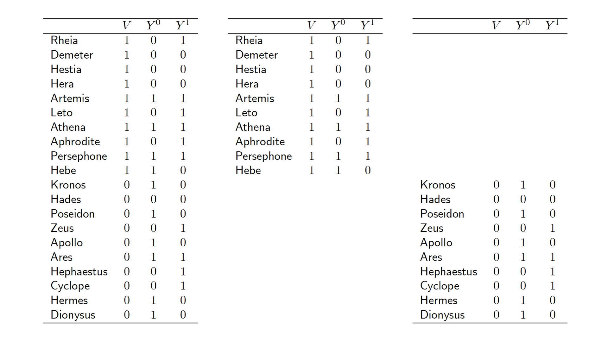
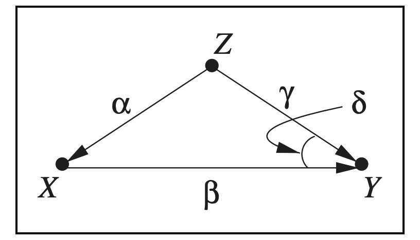

```{r knitr_init, echo=FALSE, message=FALSE, warning=FALSE}
# library
library(knitr)
library(rmdformats)

# Global Options
options(max.print = 100, stringsAsFactors = FALSE)
knitr::opts_chunk$set(
  echo = TRUE,
  tidy = TRUE,
  comment = NA,
  warning = FALSE,
  message = FALSE,
  eval = TRUE
)

knitr::opts_knit$set(width = 75)
```

# 消費者の異質性

## 消費者セグメンテーション

* 人間の消費行動には当然個体差(異質性)がある
  * 同じ性別・年齢・大学・研究室・サークルでも、消費行動は違う
* 市場は、異質な消費者によって構成されていると考えるのが一般的

> そういった、異質な消費者の集合体である市場で利益を上げ続けるためには、
> 消費者の態度、反応性、行動などの特性を的確に把握しなければならない。
> (「マーケティングの統計モデル」(朝倉書店, 佐藤, 2015))

* マーケティングで対象とするグループの大きさに着目すると・・・、
  * マスマーケティング
  * セグメンテーションマーケティング
  * One to Oneマーケティング
  
  に分類される(程度の問題)

* 別にどれが良いとか悪いとかは無い。目的に応じて使い分け
  * でも、たぶん、一番よく利用されるのが、セグメンテーションマーケティング
  * マスだと効果的な戦略を行えないし、one to oneだとコスト的に非効率なことが多いから

> セグメントとセグメンテーション
>
> 1)セグメント
> 製品やサービスに対する嗜好・興味が似ていたり、
> またはマーケティング変数(4Pとか)に対して同質の反応を示したりすることが予想される消費者のグループ
> 
> 2)セグメンテーション
> 市場セグメントを構成する、あるいは発見するプロセス

* セグメンテーションにはクラスタ分析などが使われたり…云々…


## 消費者行動のモデリング

* 一般化線形モデルの世界
  * 説明変数が同じ値であれば、パラメータの値は全員共通
  * 交互作用を入れると、群ごとの差はモデルに取り入れられる
  * これで分かることもたくさんあるし、十分これで解決できることも多い
  
* 混合モデルの世界
  * 人間が測定できない・測定しなかった個体差をモデルに組み込む
  * パラメータに階層構造をもたせたりして…階層ベイズモデルへ…


# 統計的因果推論における異質性

## 因果効果

---

**<定義>**

$X$に$X=x$という外的操作を行ったときの$Y$の確率分布を因果効果と呼ぶ。

$$
P(y|do(X=x))
$$

---

確率分布だから、$Y$の期待値を以下のように定義することができる


---

**<定義>**

$X=x$から$Y$への平均に対する因果効果

$$
E(Y|do(X=x)) = \sum_y y \times P(y|do(X=x))
$$

---

* 平均因果効果(因果リスク差)
  * 平均に対する因果効果と紛らわしいけど、$X=x$と$X=x'$を比較したときの$X$から$Y$への平均的因果効果は以下で定義される

---

**<定義>**

$$
E(Y|do(X=x)) - E(Y|do(X=x'))
$$

---


* 因果リスク比
  * 因果リスク差がよく使われるけど、因果リスク比も重要

---

**<定義>**

$$
\frac{E(Y|do(X=x))}{E(Y|do(X=x'))}
$$

---


通常の「因果効果」と言われる指標は、**平均的な**因果効果を見ている。
つまり、因果関係を図る指標の大きさが人やグループによって異なると、割と問題。


## 効果修飾と交互作用効果

### はじめに

共変量がとる値ごとに因果関係を図る指標の大きさが異なるときに、その共変量による効果の修飾(effect modification)が存在するという



* 左の集団全体だと、因果リスク差は0なので、因果効果なし
* 中央の集団だと、因果リスク差は正なので、因果効果あり
* 右の集団だと、因果リスク差は負なので、負の因果効果あり
* 集団ごとに因果効果が異なる = $V$による効果修飾の存在
  * 効果修飾の原因が$V$だとは言っていない


これって、交互作用効果と何が違うんだっけ？？


### 概念の違い

---

**<定義>交互作用効果**

$X$がとりうる値を$x_1, x_0$とし、$Z$がとりうる値を$z_1, z_0$とするとき、
$X$と$Z$の$Y$への交互作用効果を、以下のように定義する

$$
\begin{align*}
\{ P(y|do(x_1), &do(z_1)) - P(y|do(x_0), do(z_1)) \} \\
 & - \{ P(Y|do(x_1), do(z_0))  - P(y|do(x_0), do(z_0)) \} 
\end{align*}
$$

これが0でないとき、$X$と$Z$の$Y$への交互作用効果が存在する。

---

---

**<定義>効果修飾**

「共変量がとる値ごとに」因果効果の大きさが異なる

$$
\begin{align*}
\{ P(y|do(x_1), & z_1) - P(y|do(x_0), z_1) \} \\
 & - \{ P(Y|do(x_1), z_0)  - P(y|do(x_0), z_0) \} 
\end{align*}
$$

---

* 交互作用効果は、**2つの処理変数に対する外的操作**によって定義される
* 効果修飾は、**単一の変数に対する外的操作**によって定義される


### 効果修飾と交互作用効果が同じになるとき

因果ダイアグラム$G$より$X$に向かう矢線をすべて取り除いたグラフにおいて、
空集合が$(Z,Y)$についてバックドア基準を満たすならば、以下を得ることができる。

$$
P(y | do(x), do(z)) = P(y|do(x), z)
$$

このとき、交互作用効果の有無と効果の修飾の有無は一致する。


> 
do計算法の規則2(外的操作・観測変数の交換)
>
>> 
$X$に向かう矢線と、$Z$から出る矢線をすべて取り除いたグラフにおいて、$X \cup W$が$Z$と$Y$を有向分離するならば、以下が成り立つ
$$
P(y|do(x), do(z) ,w) = P(do(x), z, w)
$$


### 効果修飾と交互作用効果の関係

* $X$と$Z$の交互作用効果は存在しないが、$Z$による効果修飾は存在するケースもあり得る
* その逆もあり得る
* 因果リスク差を用いるか、因果リスク比を用いるかでも、効果修飾の存在有無は変わる


# Detecting Latent Heterogeneity

[Judea Pearl(2015) Detecting Latent Heterogeneity, *Sociological Methods and Research*](https://pdfs.semanticscholar.org/cafb/9017ecb7980ebc14b56646395c9ca757f362.pdf)

## 概要

* 研究対象の母集団が
  * 複数の小集団(subpopulation)から構成されているかどうかや、
  * 小集団ごとに処置に対する効果が異なるかどうか
* について、観察データだけから判断したい。
  * 小集団について分析者は知らない状況でも。
* 以下の3つの場合、その判断ができることを示した。
  * 2値しか取らない処置によるRCT
  * 共変量を調整することによって因果効果が識別可能なモデル
  * 中間変数によって因果効果が識別なモデル


## 2つのタイプの交絡

ここでの記法

* 潜在結果変数
  * $X=1$に割り当てられたときの結果変数を$Y_1$
  * $X=0$に割り当てられたときの結果変数を$Y_0$
* 因果効果
  * 平均因果効果
    * $E(Y_1 - Y_0) = E(Y_1)-E(Y_0)=\mathit{ATE}$
  * 処置群における平均因果効果
    * $E(Y_1 - Y_0|X=1) = E(Y_1|X=1)-E(Y_0|X=1)=\mathit{ETT}$
  * 非処置群における平均因果効果
    * $E(Y_1 - Y_0|X=0) = E(Y_1|X=0)-E(Y_0|X=0)=\mathit{ETU}$

$\mathit{ATE}$は、以下のようにいくつかの要素に分解できる

$$
\begin{align}
\mathit{ATE} &= E(Y_1-Y_0) \\
             &= E(Y|X=1)-E(Y|X=0) \\
             & \qquad - \left[ E(Y_0 |X=1) - E(Y_0|X=0) \right] \\
             & \qquad - (\mathit{ETT} - \mathit{ETU})\cdot P(X=0)
\end{align}
$$

---

**<証明>**

$$
\begin{align}
\mathit{ATE} &= E(Y_1-Y_0) \\
             &= E(Y_1) - E(Y_0) \\
             \\
             &\text{条件付き期待値に変更} \\
             &= \left[ E(Y_1 |X=1)\cdot P(X=1) + E(Y_1 |X=0)\cdot P(X=0) \right] \\
             & \qquad - \left[ E(Y_0 |X=1)\cdot P(X=1) + E(Y_0 |X=0)\cdot P(X=0) \right] \\
             \\
             &P(X=1)\text{を} \{ 1-P(X=0) \} \text{に変更}\\
             &= \left[ E(Y_1 |X=1)\cdot \{1-P(X=0)\} + E(Y_1 |X=0)\cdot P(X=0) \right] \\
             & \qquad - \left[ E(Y_0 |X=1)\cdot \{1-P(X=0)\} + E(Y_0 |X=0)\cdot P(X=0) \right] \\
             \\
             &\text{展開}\\
             &= E(Y_1|X=1) - E(Y_1|X=1)\cdot P(X=0) + E(Y_1|X=0)\cdot P(X=0) \\
             & \qquad - E(Y_0|X=1) + E(Y_0|X=1) \cdot P(X=0) - E(Y_0|X=0) \cdot P(X=0) \\
             \\
             &\text{整理} \\
             &= E(Y_1|X=1) - E(Y_0 |X=1) \\
             & \qquad -\left[ \{ E(Y_1|X=1) - E(Y_0|X=1) \} - \{ E(Y_1|X=0) - E(Y_0|X=0) \} \right] \cdot P(X=0) \\
             \\
             &E(Y_0|X=0)\text{を足して引く}\\
             &= E(Y|X=1)-E(Y|X=0) \\
             & \qquad - \left[ E(Y_0 |X=1) - E(Y_0|X=0) \right] \\
             & \qquad - (\mathit{ETT} - \mathit{ETU})\cdot P(X=0)
\end{align}
$$

---

* $E(Y_0 |X=1) - E(Y_0|X=0)$
  * 処置群と非処置群のno-treatmentのときの結果変数の差
  * baseline bias
* $\mathit{ETT} - \mathit{ETU}$
  * 処置群と非処置群の効果の違い
  * Variable-Effect bias

## Variable-Effect biasから固定効果を分離させる

例えば、以下のグラフのモデルを考える



構造方程式で書くと

$$
\begin{align}
y &= \beta x + \gamma z + \delta xz + \epsilon_1 \\
x &= \alpha z + \epsilon_2 \\
z &= \epsilon_3
\end{align}
$$

このとき、variable-effect biasは、以下のように求まる

$$
\textit{ETT} - \textit{ETU} = \alpha \delta (x' - x)^2
$$

また、baseline biasは、以下のようになる

$$
E(Y_x | X= X') -E(Y_x | X=x) = \gamma \alpha (x' - x)
$$

証明は論文のappendix Bにあるので、省略。

baseline biasは交互作用関係なく生生じるのに対して、variable-effect biasは交互作用$\delta$によって生じている。

ただし、$\alpha =0$のとき、$\textit{ETT} - \textit{ETU}$は消えるので、
$Z$が$X$の割当てに作用しない限り、$\textit{ETT} - \textit{ETU}$の差だけでは、異質性は明らかにならない


## 異質性を特定する3つの方法

前のパートまでで、異質性の元となる共変量を特定しなくても、ETTとETUを識別できれば、異質性の兆候を発見できることがわかった。

また、グラフィカルモデルを使えば、ETTとETUを識別するためにはどの変数を測定し、どのようにETTとETUを推定すればよいかが分かる。


### RCTによって異質性を特定する

$E(Y_0)$と$E(Y_1)$が識別できているのであれば、ETTとETUも識別可能

$$
\begin{align}
\text{ここで} p=P(X=1) \text{とする}\\
\\
\textit{ETT}  &= E(Y_1 - Y_0 |X=1) \\
              &= E(Y_1 |X=1) - E(Y_0|X=1) \\
              \\
              &\text{consistensyの仮定より} \\
              &= E(Y|X=1) - E(Y_0|X=1) \\
              \\
              & \text{以下の関係式を用いる} E(Y_0) = E(Y_0|X=1)p + E(Y_0|X=0)(1-p) \\
              &=E(Y|X=1) - \{ E(Y_0) - E(Y|X=0)(1-p) \} / p \\
\\              
\text{同様に} \\
\\
\textit{ETU} &= E(Y_1 - Y_0 |X=0) \\
             &= \{ E(Y_1) - E(Y|X=1)p \}(1-p) - E(Y|X=0)
\end{align}
$$

上記を使うと、$\textit{ETT} - \textit{ETU}$が計算できる。

RCTをやってるのに、処置群と非処置群で因果効果が違うのだったら、少なくとも何かしら因果効果の違うグループがあることが分かる


### 調整によって異質性を特定する

バックドア基準を満たす共変量集合$Z$が観測できているのであれば、$\textit{ETT}$と$\textit{ETU}$は識別可能である。

以下では、$Z$がバックドア基準を満たすと仮定する。

* バックドア調整による因果効果
$$
E(Y_x) = \sum_z E(Y|x,z)P(z)
$$

* バックドア調整によるETT
$$
E(Y_x|x') = \sum_z E(Y|x,z)P(z|x')
$$

上記を用いると、$\textit{ETT}$と$\textit{ETU}$の差は、以下のように求められる

$$
\begin{align}
\textit{ETT} - \textit{ETU} &= E(Y_{x'} - Y_x | X = x') - E(Y_{x'} - Y_x | X = x) \\
\\
                            &= \sum_z \left[ E(Y|X=x',z) - E(Y|X=x,z) \right] \left[ P(z|X=x')-P(z|X=x) \right]
\end{align}
$$

---

**<証明>**

ここからちゃんと追えてないので、次回…

---


### フロントドア基準による異質性の特定

フロントドア基準を使うと、これまでと同じように、ETTとETUを計算できるから…、
未観測共通原因があっても異質性を特定できる場合がある


# 今後

異質性のあるデータで因果探索をする論文があったので、これを読む(割と長いけど…)

[Biwei Huang(2020) Causal Discovery from Heterogeneous/Nonstationary Data](https://arxiv.org/abs/1903.01672)

ざっと見た感じ、制約ベースのアルゴリズム

# 参考文献

黒木学(2017) 構造的因果モデルの基礎, 共立出版
Judea Pearl(2015) Detecting Latent Heterogeneity, *Sociological Methods and Research*
